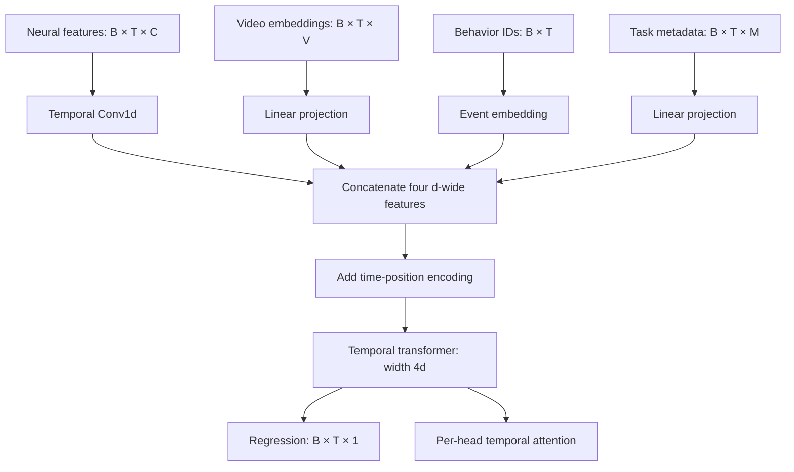

# Multimodal Neural Modeling & Model Interpretability

[](https://github.com/sidhulyalkar/neural-mm-tf-mechint/actions/workflows/ci.yml)
[](pyproject.toml)
[](model.py)

**A reproducible pipeline for learning from neural features, video embeddings, behavioral events, and task context—and inspecting what the resulting model uses.**

Built by [Sidharth Hulyalkar](https://sidhulyalkar.com), this research engineering project connects multimodal data contracts, custom PyTorch encoders, temporal transformer modeling, and controlled model interventions in one runnable workflow.

Neural measurements become more useful when analyzed alongside what an animal or person is seeing, doing, and being asked to do. This project explores that modeling problem through a compact reference implementation: four aligned input streams, modality-specific representations, a shared temporal model, and evaluation tools that make its behavior inspectable.

**Current scope:** a tested synthetic research prototype. The repository accepts aligned feature tensors and generates a learnable synthetic task. It does not yet ingest raw recordings, extract features from video frames, or report results on a biological dataset.

[Run the demo](#run-the-cpu-demo) · [Engineering case study](docs/engineering-case-study.md) · [Architecture & data contracts](docs/architecture.md) · [Evaluation & results](docs/evaluation.md)

## What the project demonstrates

| Area | Implementation | Code to inspect |
|---|---|---|
| Multimodal pipeline design | Stable examples, explicit shapes/dtypes, independent train/validation/test random streams, shared batch preparation | [Simulation](data_simulation.py), [data loaders](dataloaders.py) |
| Model development | Temporal neural convolution, video/metadata projections, categorical event embeddings, feature fusion, positional encoding, transformer blocks | [Encoders](encoders/), [model](model.py) |
| Experiment engineering | Configurable CLI, seeded CPU execution, validation-selected checkpoints, train-only baselines, saved metrics and provenance | [Training](train.py), [baselines](baselines.py) |
| Model inspection | Per-head temporal attention, paired modality removal, reversible head interventions | [Interpretability tools](interpretability/) |
| Usable research software | Saved-run dashboard, installable package, regression tests, CPU CI | [Dashboard](dashboard.py), [tests](tests/), [CI](.github/workflows/ci.yml) |

## Architecture at a glance



Each timestep is a token containing all four encoded modalities. Attention therefore connects **time positions after fusion**; the attention maps are not a four-by-four modality interaction matrix. The model uses bidirectional attention and a centered convolution for offline analysis.

## Run the CPU demo

Python 3.10+ is required; CI exercises Python 3.11 and 3.12. No dataset download or GPU is required.

```bash
git clone https://github.com/sidhulyalkar/neural-mm-tf-mechint.git
cd neural-mm-tf-mechint
python -m venv .venv
source .venv/bin/activate  # Windows PowerShell: .venv\Scripts\Activate.ps1
python -m pip install -e '.[dashboard]'
python train.py --config configs/config.yaml --output runs/demo
python -m streamlit run dashboard.py
```

Training defaults to CPU and one thread. For Linux CPU-only environments, install the [PyTorch CPU build](https://pytorch.org/get-started/locally/) before installing this package. GPU execution is optional via `--device cuda`; exact repeatability across devices or library versions is not assumed.

The dashboard opens a saved run and displays learning curves, a held-out prediction sequence, attention heatmaps, modality-removal results, and a head-ablation control. Before training, it shows an actionable empty state.

Use a fresh `--output` directory for each run. The installed `multimodal-train` command accepts the same arguments; run it from this checkout or provide an absolute `--config` path.

| Artifact in `runs/demo/` | Purpose |
|---|---|
| `checkpoint.pt` | Best validation model, embedded config, selected epoch, schema version |
| `metrics.json` | Training history, validation selection, final test MSE and baseline scores |
| `ablations.json` | Full-test-set MSE changes after removing each encoded modality |
| `baselines.json` | Training-fitted constant and ridge weights |
| `config.yaml` | Resolved experiment configuration |
| `manifest.json` | Seeds, versions, device, parameter count, Git state and source hashes |

## A result you can reproduce

The example task combines known contributions from all four modalities and a one-step neural lag. It tests whether the software can recover a controlled relationship and expose model sensitivity. A linear ridge baseline is included because the target is largely linear by construction.

| Predictor | Test MSE ↓ |
|---|---:|
| Constant baseline | 1.62073 |
| Multimodal transformer | 0.00741 |
| Linear ridge + neural lag | 0.00248 |

The transformer learns the task; the matched linear model performs better. This is evidence that the pipeline works, not evidence of transformer superiority.


See the [recorded CPU run](examples/cpu-demo/README.md) for measured results and the exact configuration, and the [evaluation guide](docs/evaluation.md) for the target equation and interpretation limits. The checked-in evidence contains small JSON/YAML artifacts; checkpoints are generated locally.

## Inspect or extend the model

```python
from dataloaders import get_loader, prepare_batch
from interpretability.attention_analysis import extract_attention_maps
from train import load_checkpoint

model, checkpoint = load_checkpoint("runs/demo/checkpoint.pt")
inputs, target = prepare_batch(next(iter(get_loader(checkpoint["config"], "test"))))
attention = extract_attention_maps(model, inputs, layer_idx=0, head_idx=0)
print(attention.shape)  # (24, 24): query time × key time
```

- **Add a data source:** implement the [aligned sample contract](docs/architecture.md#input-contract), with subject/session splits and training-only preprocessing upstream.
- **Change the representation:** replace one of the four encoders while preserving `[B, T, d]` outputs.
- **Compare fusion strategies:** start with the implemented concatenation baseline. `CrossModalAttention` in [fusion.py](fusion.py) is a standalone primitive and is not wired into the training model.
- **Probe a concept:** the optional `concepts` extra provides a binary linear separator over supplied activations. Activation collection, held-out probe scoring, and TCAV significance analysis remain future work.

## Validation and development

```bash
python -m pip install -e '.[dev,dashboard,concepts]'
python -m ruff check .
python -m pytest -q
python -m build
```

Tests cover the data contract, deterministic split generation, gradients through every encoder, configuration handling, checkpoint selection/reload, actual head-removal semantics, restoration after errors, and dashboard interactions. See [CONTRIBUTING.md](CONTRIBUTING.md) for the development workflow.

## Research boundaries and next steps

The next substantive milestone is a public biological dataset with explicit synchronization, subject/session-separated evaluation, and matched unimodal baselines. Other open work includes variable-length masks, missing-modality training, alternative fusion comparisons, and independently evaluated concept probes. [The roadmap](docs/roadmap.md) gives concrete acceptance criteria.

This implementation does not establish clinical utility, online BCI performance, causal neural mechanisms, or state-of-the-art decoding. Those questions require evidence beyond a synthetic demonstration.

**Author:** [Sidharth Hulyalkar](https://sidhulyalkar.com) · [GitHub](https://github.com/sidhulyalkar)
