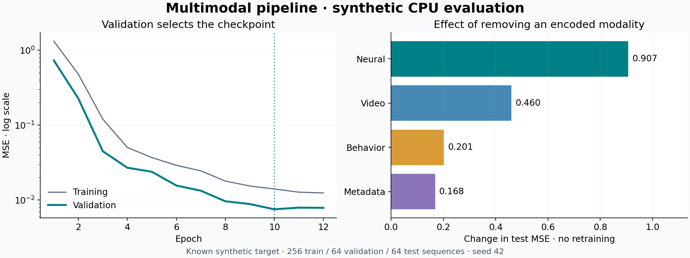

# Recorded synthetic CPU example

This example was run with the checked-in configuration: seed 42, 256/64/64 train/validation/test sequences, 24 timesteps, and 12 training epochs. These are synthetic implementation results, not neuroscience benchmark scores.

| Predictor | Held-out test MSE |
|---|---:|
| Training-target mean | 1.620729 |
| Multimodal transformer | 0.007412 |
| Linear ridge with neural lag features | 0.002476 |

The transformer learns the controlled relationship. The matched linear baseline performs better, as expected for this linear target. Checkpoint selection used validation MSE, selecting epoch **10** at **0.007534**. The transformer has **67,777** trainable parameters.

| Intervention | Test MSE | Change from full model |
|---|---:|---:|
| Remove neural | 0.914442 | +0.907030 |
| Remove video | 0.467733 | +0.460320 |
| Remove behavior | 0.208729 | +0.201317 |
| Remove meta | 0.175330 | +0.167918 |

Each intervention zeros an encoded branch without retraining. All use the same test examples. This measures model sensitivity under this removal operation, not a unique causal contribution.



## Reproduce

From the repository root:

```bash
python train.py --config examples/cpu-demo/config.yaml --output runs/reproduction
python scripts/render_results.py runs/reproduction
```

The figure requires the `dashboard` extra (Matplotlib). The snapshot includes [metrics](metrics.json), [ablations](ablations.json), [fitted baselines](baselines.json), [configuration](config.yaml), and [provenance](manifest.json). Regenerate the checkpoint locally; it is intentionally not checked into Git.

Execution used Python **3.12.13**, PyTorch **2.14.0+cpu**, NumPy **2.3.5**, CPU, and one thread. The source tree was modified at execution; its exact Python-file hashes are recorded in the manifest. Numeric results can vary with other versions or devices. No GPU was used and no multi-seed uncertainty estimate is claimed.
